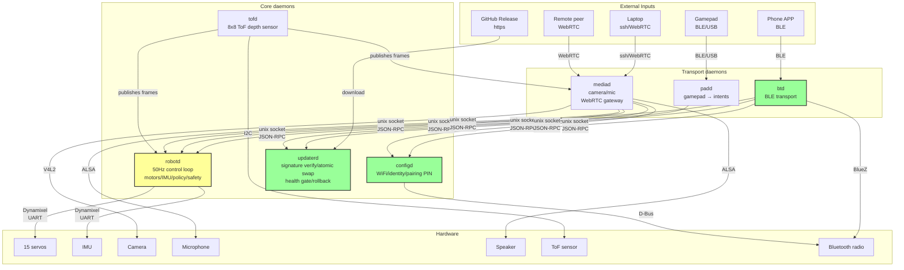
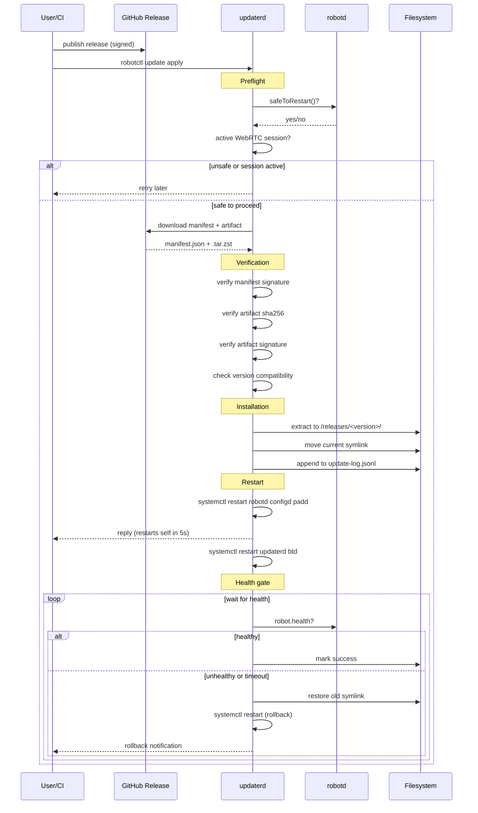
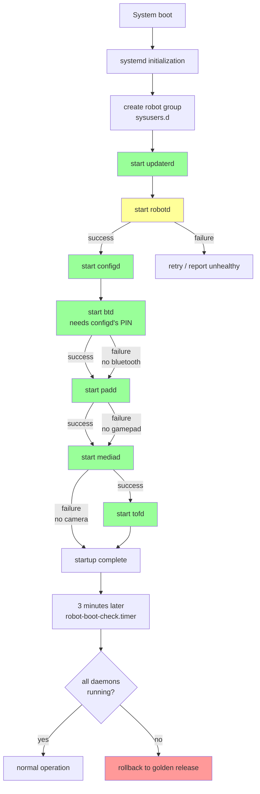
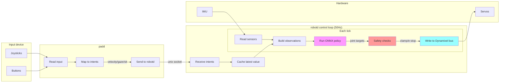
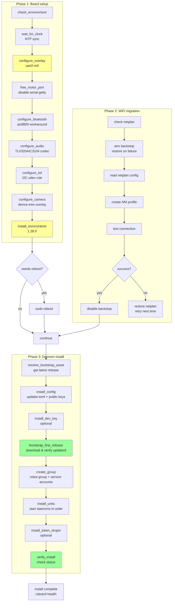
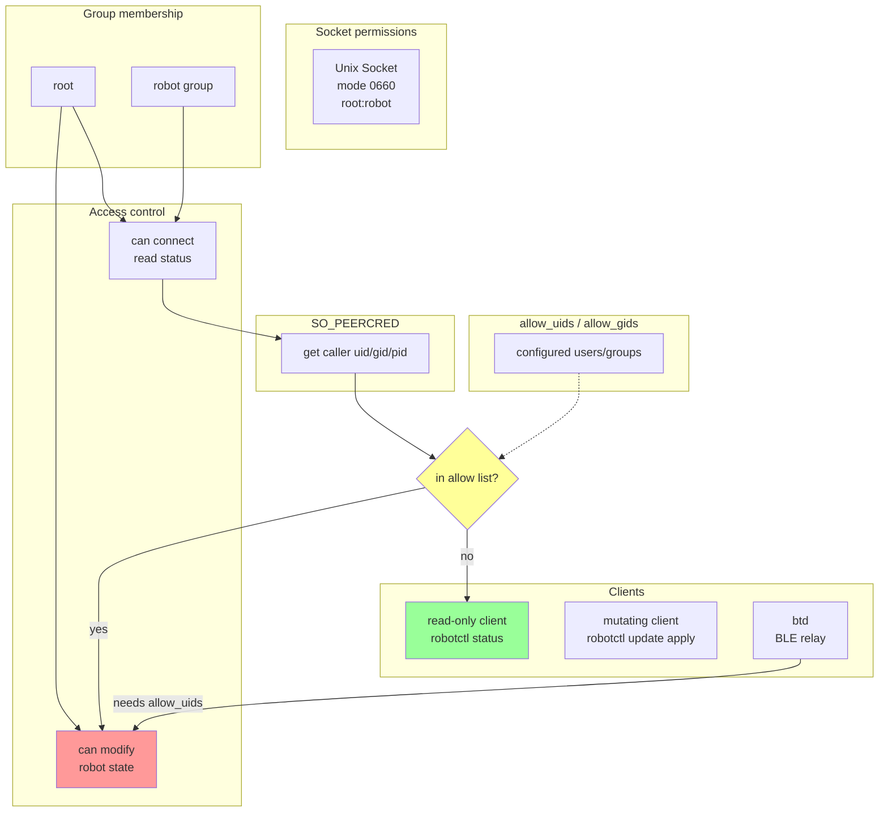

# Software Flow Diagrams

Status: draft · Date: 2026-09-10

Companion to [`architecture.md`](architecture.md). These diagrams visualize the system architecture, data flows, and operational sequences.

## 1. System Architecture Overview



**Key points:**
- `robotd` is the only daemon that touches motors — all others send intents
- Three daemons survive a dead `robotd`: `configd`, `updaterd`, `btd` — they are the recovery path
- `btd`, `padd`, `mediad` own nothing — they are transports
- `tofd` publishes frames and reads nothing

## 2. Release Installation / Update Flow



**Key points:**
- Signatures and hashes verified before any filesystem changes
- Atomic symlink swap — either the whole release is live or none of it
- Health gate with automatic rollback on failure
- `updaterd` restarts itself last (cannot restart mid-update)

## 3. Daemon Startup Sequence



**Key points:**
- `configd` before `btd`: btd asks configd for the pairing PIN
- `mediad` last: it forwards calls to three other daemons
- `btd`/`padd`/`mediad` allowed to fail — robot still walks without them
- Boot check timer fires 3 minutes after boot, rolls back if daemons didn't come up

## 4. Control Loop (Gamepad → Motors)



**Key points:**
- 50Hz tick rate — real-time enough for walking
- `robotd` subscribes to intents, reads a cached latest value (non-blocking)
- Safety layer clamps joint limits, detects falls, can e-stop
- Policy output is joint targets; safety decides what's executable

## 5. First-time Provisioning Flow



**Key points:**
- Phase 1 (`setup-board.sh`) is OS-level: overlays, ONNX Runtime, audio codec
- Phase 2 (`migrate-network.sh`) moves from netplan to NetworkManager
- Phase 3 (`install.sh`) installs the daemon release via the real update engine
- Each phase is idempotent and can be re-run independently

## 6. IPC Communication Model

```mermaid
flowchart TB
    subgraph "Unix Sockets (JSON-RPC 2.0, NDJSON)"
        SOCK_ROBOTD[/run/robotd.sock]
        SOCK_CONFIGD[/run/configd.sock]
        SOCK_UPDATERD[/run/updaterd.sock]
        SOCK_TOFD[/run/tofd/tof.sock]
    end
    
    subgraph "Request/Response"
        REQ[request<br/>id + method + params]
        RESP[response<br/>id + result/error]
    end
    
    subgraph "Notifications (subscriptions)"
        NOTIF[notification<br/>method + params<br/>no id]
    end
    
    subgraph "Clients"
        ROBOTCTL[robotctl]
        PADD_CLIENT[padd]
        BTD_CLIENT[btd]
        MEDIAD_CLIENT[mediad]
    end
    
    subgraph "Services"
        ROBOTD[robotd]
        CONFIGD[configd]
        UPDATERD[updaterd]
        TOFD[tofd]
    end
    
    ROBOTCTL -->|robot.health| SOCK_ROBOTD
    PADD_CLIENT -->|robot.intent| SOCK_ROBOTD
    BTD_CLIENT -->|robot.*| SOCK_ROBOTD
    BTD_CLIENT -->|net.*| SOCK_CONFIGD
    BTD_CLIENT -->|update.*| SOCK_UPDATERD
    MEDIAD_CLIENT -->|robot.*| SOCK_ROBOTD
    
    ROBOTD --- SOCK_ROBOTD
    CONFIGD --- SOCK_CONFIGD
    UPDATERD --- SOCK_UPDATERD
    TOFD --- SOCK_TOFD
    
    SOCK_ROBOTD --> REQ
    REQ --> ROBOTD
    ROBOTD --> RESP
    RESP --> SOCK_ROBOTD
    
    TOFD -->|tof.stream| NOTIF
    NOTIF --> SOCK_TOFD
    SOCK_TOFD --> MEDIAD_CLIENT
    
    style SOCK_ROBOTD fill:#9cf
    style SOCK_CONFIGD fill:#9cf
    style SOCK_UPDATERD fill:#9cf
    style SOCK_TOFD fill:#9cf
```

**Key points:**
- One socket per service — no broker, no bus
- JSON-RPC 2.0 with NDJSON framing (one object per line)
- Requests have `id`, responses correlate by `id`
- Notifications have no `id` — used for subscriptions and event streams
- `tofd` publishes frames as a stream of notifications

## 7. Security & Authorization Model



**Key points:**
- Socket mode 0660 + `robot` group: only group members can connect
- `SO_PEERCRED` identifies the caller (uid/gid/pid)
- `allow_uids`/`allow_gids` in config: who may mutate robot state
- Read-only access granted to all `robot` group members
- `btd` must be in `allow_uids` to relay update requests from BLE

## 8. State Ownership & Persistence

```mermaid
flowchart TB
    subgraph "Per-board config (survives update + rollback)"
        ETC_ROBOT[/etc/robot/]
        UPDATER_TOML[updater.toml]
        ROBOTD_TOML[robotd.toml]
        TRUSTED_KEYS[trusted_keys/]
        CONFIG_JSON[config.json<br/>name + PIN]
    end
    
    subgraph "Release artifacts (swapped atomically)"
        OPT_ROBOT[/opt/robot/daemon/]
        RELEASES[releases/<version>/]
        CURRENT[current -> releases/<version>]
    end
    
    subgraph "Runtime state (survives reboot)"
        VAR_LIB[/var/lib/robot/]
        UPDATE_LOG[update-log.jsonl]
        BOOT_COUNTER[boot-counter]
        LOCK[lock file]
    end
    
    subgraph "Volatile state (lost on power cut)"
        VAR_LOG[/var/log<br/>zram device]
        JOURNAL[journald]
    end
    
    ETC_ROBOT --> UPDATER_TOML
    ETC_ROBOT --> ROBOTD_TOML
    ETC_ROBOT --> TRUSTED_KEYS
    ETC_ROBOT --> CONFIG_JSON
    
    OPT_ROBOT --> RELEASES
    OPT_ROBOT --> CURRENT
    
    VAR_LIB --> UPDATE_LOG
    VAR_LIB --> BOOT_COUNTER
    VAR_LIB --> LOCK
    
    VAR_LOG --> JOURNAL
    
    style ETC_ROBOT fill:#9f9
    style VAR_LIB fill:#9f9
    style OPT_ROBOT fill:#ff9
    style VAR_LOG fill:#f99
```

**Key points:**
- `/etc/robot/`: per-board config, never overwritten by updates
- `/opt/robot/daemon/releases/`: release artifacts, swapped atomically
- `/var/lib/robot/`: durable runtime state (fsynced)
- `/var/log`: zram on this image — journal survives reboot but not power cut
- Update history is the durable record, not the journal
